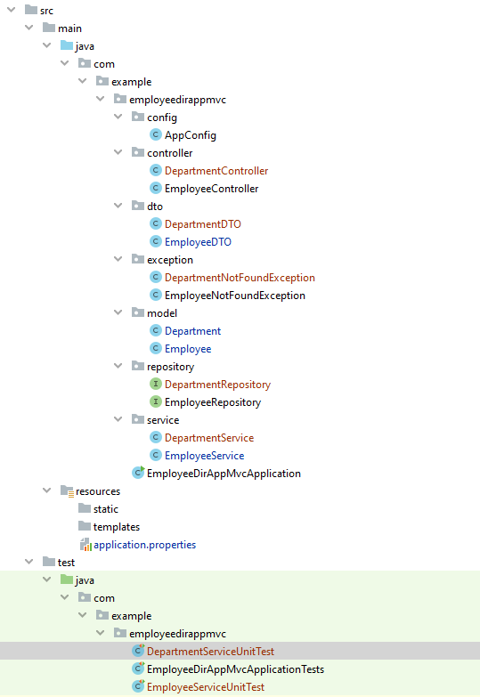
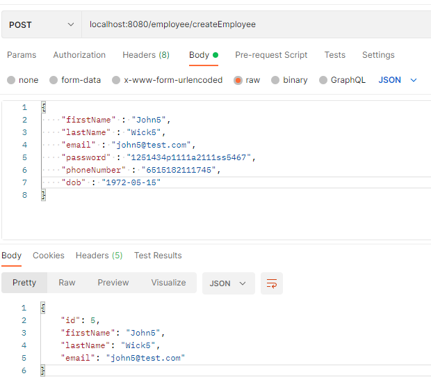
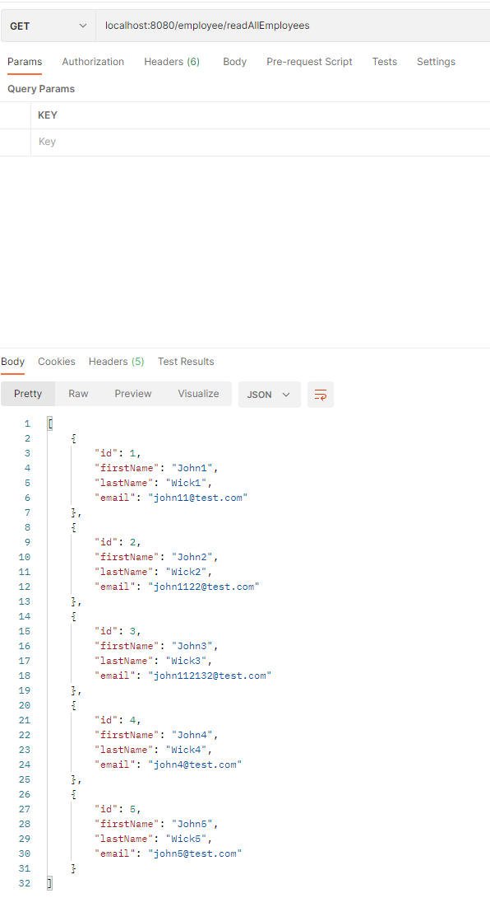
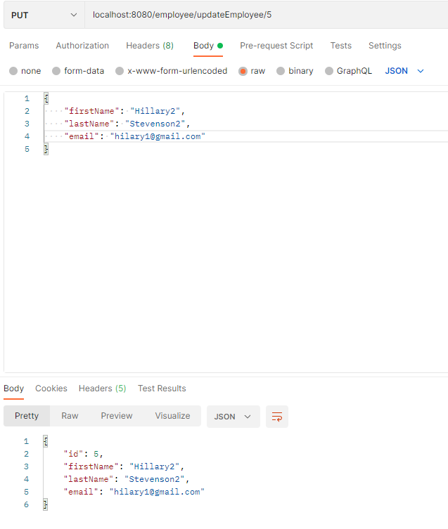
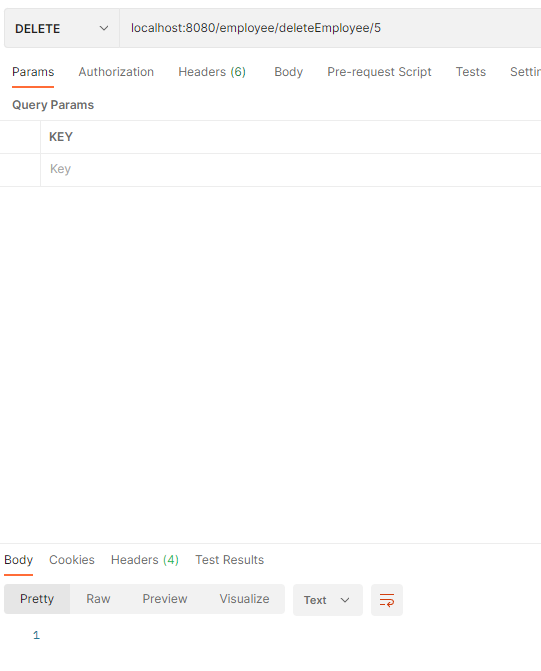

# employee-management-app
_A fully fledged Spring Boot application showcasing the basic CRUD operations._  

### What's inside  
* Maven
* Spring Core
* Spring Data (Hibernate & MySQL)
* Spring MVC (Tomcat)
#
## Installation  
The project is created with Maven, so you just need to import it to your IDE and build the project to resolve the dependencies.
#
## Database configuration 

Create a MySQL database with the name employee_list and add the credentials to /resources/application.properties.
The default ones are :

 

#

## Project structure  

#

## ER Diagram  

## Usage  
#
Run the project through the IDE or run: **mvn spring-boot:run** command in the command line and head out to Postman to check the REST endpoints.

* Create

 

#

* Read 

 

#

* Update

  

#

* Delete

  

