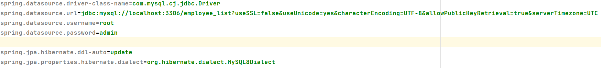
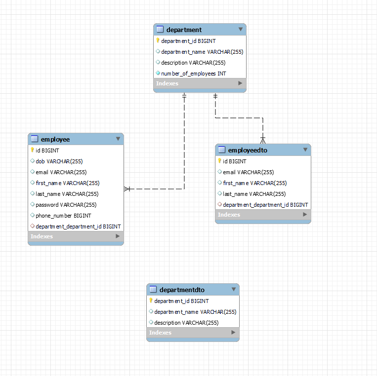
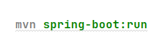

# employee-management-app
_A fully fledged Spring
Boot application showcasing the basic CRUD operations on Employee entity._
#

#### What's inside  
* Maven *
* Spring Core *
* Spring Data (Hibernate & MySQL) *
* Spring MVC (Tomcat) *
#
#### Installation  
The project is created with Maven, so you just need to import it to your IDE and build the project to resolve the dependencies.
#
#### Database configuration  
#
Create a MySQL database with the name employee_list and add the credentials to /resources/application.properties.
The default ones are :

 

#### Project structure  

// display project folder structure screenshot

ER Diagram

// execution postman screenshot crud
* Create
 

* Read
 

* Update
 

* Delete
 

#### Usage  
#
Run the project through the IDE and head out to Postman to check Rest endpoints

or

run this command in the command line:

